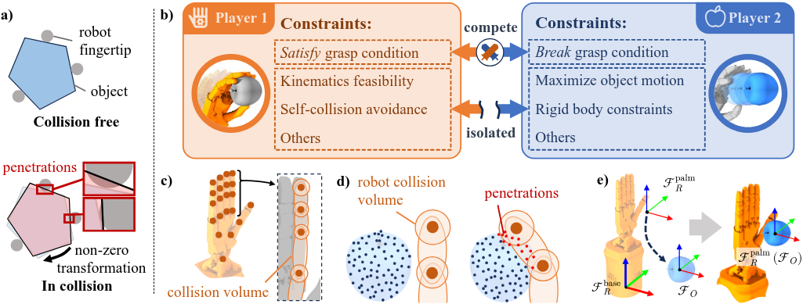

# Game4Grasp

Open source code repository for **Adversarial Game-Theoretic Algorithm for Dexterous Grasp Synthesis**


[Yu Chen](https://neuling-jpg.github.io/yu.github.io/)<sup>1</sup>, 
[Botao He](https://bottle101.github.io/)<sup>2</sup>,
[Yuemin Mao](https://yueminm.github.io/)<sup>1</sup>,
[Arthur Jakobsson](https://arthurjakobsson.com/)<sup>1</sup>,
[Jeffrey Ke](https://www.linkedin.com/in/jeffke)<sup>1</sup>,
[Yiannis Aloimonos](https://robotics.umd.edu/clark/faculty/350/Yiannis-Aloimonos)<sup>2</sup>,
[Guanya Shi](https://www.gshi.me/)<sup>1</sup>,
[Howie Choset](https://en.wikipedia.org/wiki/Howie_Choset)<sup>1</sup>,
[Jiayuan Mao](https://jiayuanm.com/)<sup>3</sup>,
[Jeffrey Ichnowski](https://ichnow.ski/)<sup>1</sup>.


<sup>1</sup>Carnegie Mellon University, <sup>2</sup>University of Maryland, <sup>3</sup>University of Pennsylvania.

<p align="center">
    <a href='https://arxiv.org/abs/2511.05809'>
      
    </a>
    <a href='https://neuling-jpg.github.io/game4grasp.github.io/'>
      
    </a>
</p>

<div align="center">
  
</div>
<p>
Overview of the proposed grasp synthesis approach. a) Our method relies on a firm grasp condition that once satisfied, any non-zero object transformation will result in object-robot penetration. b) The problem is formulated as a two-player game. Player~1 seeks to satisfy the firm grasp condition, while Player~2 attempts to break it. The two players compete specifically on this condition, whereas all other constraints are isolated within their respective optimization problems. c) We model the hand by attaching spatial points to base and joint frames: joints are represented as spheres at joint centers, and links as ellipsoids with foci at their endpoints. d) The object is modeled as a set of points directly sampled from its point cloud. Penetration occurs if any of these points fall within the robot’s collision volume. e) For algorithm initialization, we align the palm frame $\mathcal{F}_R^\text{palm}$ and the object frame $\mathcal{F}_O$.
</p>


## Compile and Run Game4Grasp

We are still working on the direct integration of the C++ library with Python, but you can build the C++ code and run the tests following ```game4grasp/grasp/README.md```.

## Validation

We implement Torch and Isaac Gym validation, with the majority of the code adapted from the [D(R, O) Grasp](https://github.com/zhenyuwei2003/DRO-Grasp) project. 

### Prerequisites

- Python 3.8
- PyTorch >= 2.3.0

To create environment:

```bash
conda create -n grasp python==3.8
conda activate grasp
pip install -r requirements.txt
```

Download [Isaac Gym](https://developer.nvidia.com/isaac-gym/download) from the official website, then:

```bash
tar -xvf IsaacGym_Preview_4_Package.tar.gz
cd isaacgym/python
pip install -e .
```

### Validate

To validate game4grasp on CMapDataset for robots including Allegro, Barrett, Shadowhand, and LeapHand, simply run:

```
python validate.py
```

Or to validate on a specific robot:

```
python validate.py --robot_name allegro
```

## Dataset

You can download the filtered dataset contributed by [D(R, O) Grasp](https://github.com/zhenyuwei2003/DRO-Grasp) project, URDF files and point clouds [here](https://github.com/zhenyuwei2003/DRO-Grasp/releases/tag/v1.0) and unzip the contents into the `data/` folder.

## Repository Structure

```bash
Game4Grasp
├── grasp/  # Game4Grasp main algorithm
│   ├── build/
│   │   └── ...          
│   ├── include/
│   │   ├── core/  # Core optimization components
│   │   │   ├── grasp_solver.hpp
│   │   │   ├── object_optimizer.hpp
│   │   │   └── robot_optimizer.hpp
│   │   ├── kinematics_models/   # Kinematics models for robotic hands
│   │   │   ├── robot_model_sheets/
│   │   │   │   ├── allegro.hpp
│   │   │   │   ├── barret.hpp
│   │   │   │   ├── leaphand.hpp
│   │   │   │   └── shadowhand.hpp
│   │   │   ├── kinematics_model.hpp
│   │   │   └── robot_registry.hpp
│   │   ├── utils/  # Utilities
│   │   │   ├── utils.hpp
│   │   │   └── vec_type.hpp
│   │   └── grasp.hpp  # Main header for library inclusion
│   ├── source/  # C++ source implementations
│   │   ├── core/
│   │   │   ├── object_optimizer/
│   │   │   │   ├── constraints.cpp
│   │   │   │   ├── gradients.cpp
│   │   │   │   ├── object_optimizer.cpp
│   │   │   │   └── setup.cpp
│   │   │   ├── robot_optimizer/
│   │   │   │   ├── constraints.cpp
│   │   │   │   ├── forward.cpp
│   │   │   │   ├── gradients.cpp
│   │   │   │   ├── robot_optimizer.cpp
│   │   │   │   └── setup.cpp
│   │   │   └── grasp_solver.cpp
│   │   ├── utils/
│   │   │   └── utils.cpp
│   │   └── grasp.cpp
│   ├── test/  # Unit tests and validation cases
│   │   └── test_grasp.cpp
│   ├── pybind/  # Python bindings for the C++ library
│   │   └── grasp_bind.cpp
│   └── CMakeLists.txt
├── grasp_pywrapper/  # Python interface of game4grasp c++ code
├── data/  # Downloaded datasets (raw and processed) @ D(R, O)
├── validation/  # Validation scripts (e.g., for Isaac Gym) @ D(R, O)
└── validate.py  # Entry point for running validation
```


## Citation

If you find our codes or models useful in your work, please cite our paper:

```
@article{chen2025adversarial,
  title={Adversarial Game-Theoretic Algorithm for Dexterous Grasp Synthesis},
  author={Chen, Yu and He, Botao and Mao, Yuemin and Jakobsson, Arthur and Ke, Jeffrey and Aloimonos, Yiannis and Shi, Guanya and Choset, Howie and Mao, Jiayuan and Ichnowski, Jeffrey},
  journal={arXiv preprint arXiv:2511.05809},
  year={2025}
}
```
